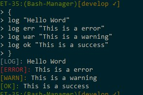

Bash Manager
============

Nos gusta trabajar con complementos para los distintas aplicaciones, BASHm permite usar distintos complementos que enriquecen tu experiencias usando bash.


Índice
------

1. [Como instalar](#como-instalar)
2. [Instalar un Complemento](#instalar-un-complemento)
3. [Opciones](#opciones)
    1. [Dentro de `.bashrc` o `.bash_profile`](#dentro-de-bashrc-o-bash_profile)
4. [Log Function](#log-function)


Como Instalar
-------------

> **NOTA:** Windows no posee `bash` por su defecto, recomendamos instalar [Cygwin](https://www.cygwin.com/) o [MSYS-git UNIX tools](https://msysgit.github.io/).

```bash
git clone https://github.com/jonDotsoy/Bash-Manager.git bashm
```

Agregamos la siguiente líneas dentro del archivo `.bashrc` o `.bash_profile`.

```bash
export BASHM_PATH=${HOME}/bashm
source ${BASHM_PATH}/bashm.bash
```

Finalizando Inicializando el archivo de configuración.

```bash
bashm init
```

Instalar un Complemento
-----------------------

```bash
bashm install <name> [URL] [force]
# Example.
# $ bashm install alias_ls
# $ bashm install alias_ls https://cdn.rawgit.com/jonDotsoy/Bash-Manager/master/down_plugins/alias_ls.bash
```

Usamos el comando `bashm install` para poder instalar un complemento al bash usando bashm.


Opciones
========

## Dentro de `.bashrc` o `.bash_profile`

Las opciones se pueden fijar dentro del bash alternando los archivos `.bashrc` o `.bash_profile` para mantener las configuraciones dentro del shell.

```bash
# ~/.bashrc
...
export LOG_DECORATE=false
...
```

Log Function
------------

Es una herramienta que integra BashM para generar mensajes LOG en el terminal.




```bash
$ log [type] <Message>
# Example:
# log warn "This is a warning"
 ```

### Opción `LOG_DECORATE` (Boolean)

Muestra los mensajes con decoración.


### Opción `LOG_PREFIX` y `LOG_SUFFIX`

Permite asociar mensajes a los logs decoraciones al final (LOG_SUFFIX) y al principio (LOG_PREFIX) de los mensajes. 


